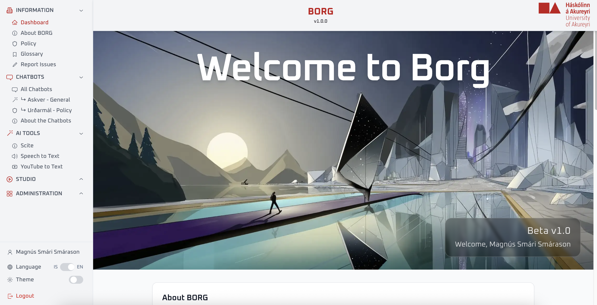
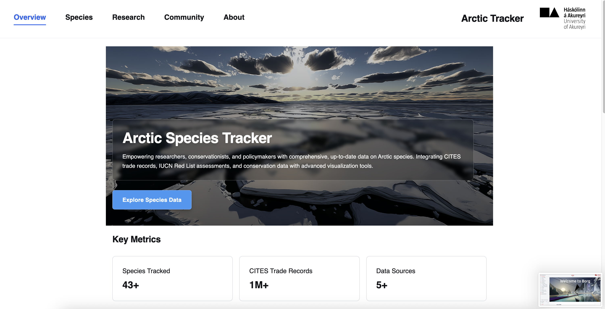
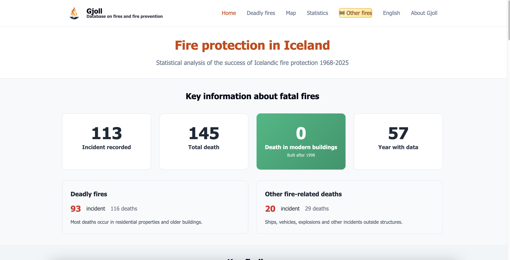

# Local AI agentic system - Oxford AI Summit 2025

> **Building Enterprise Multi-Agent AI Systems Locally**


## 🌟 Overview

Transform single AI models into orchestrated multi-agent systems running entirely on local hardware. This repository contains the presentation and live demo from Oxford AI Summit 2025.

### Key Features

- **100% Local Execution** - No cloud dependencies, complete data sovereignty
- **Multi-Agent Orchestration** - 5 specialized agents working together
- **Consumer Hardware** - Runs on RTX 3080/4070+ or Apple Silicon
- **Real-time Demo** - Watch agents collaborate with streaming responses

## 🏆 My AI Projects Portfolio

### BORG Ecosystem - University AI Infrastructure


**Full-stack AI platform serving University of Akureyri**
- 🎓 Serves entire university with hybrid local/cloud AI
- 🔧 Built by 2 developers + IT support since January 2024
- 🚀 Modular "Borg cubes" architecture (Star Trek easter egg!)
- 💡 Proves local AI works at institutional scale

### Arctic Species Tracker - Environmental Monitoring


**AI-powered environmental monitoring system**
- 🐻 Real-time species tracking and habitat analysis
- 📊 Machine learning models for population predictions
- 🌍 Climate impact assessment tools
- 📱 Mobile app for field researchers

### Fire Protection Iceland - Data-Driven Safety


**Predictive analytics for fire safety**
- 🔥 Risk assessment using historical data
- 📍 Geographic analysis of fire patterns
- 🚨 Early warning system integration
- 📈 Resource optimization for emergency services

### University AI Lab - Hardware Infrastructure


**State-of-the-art local AI computing**
- 💻 RTX 5090 + 4090 GPU setup
- 🔬 Experimentation & production environment
- 🏢 Local VM infrastructure
- 🔐 Complete AI sovereignty - no cloud required

---

*All projects built with AI-assisted development using VS Code + Copilot, Claude Code, and local AI models*

## 🚀 Quick Start

### Prerequisites

- Python 3.10+
- [Ollama](https://ollama.ai) installed
- 18GB+ VRAM recommended (or Apple Silicon with 32GB+ unified memory)

### Installation

```bash
# Clone the repository
git clone https://github.com/Magnussmari/Oxford-ai-summit-2025-Local-Agents.git
cd Oxford-ai-summit-2025-Local-Agents

# Install Python dependencies
pip install -r demo/requirements.txt

# Pull required models (one-time setup, ~18GB total)
./models/pull_models.sh

# Launch the demo
cd demo && ./launch.sh
```

Visit http://localhost:8000 to see the agents in action!

## 🤖 The Agent Team

| Agent | Model | Purpose | VRAM |
|-------|-------|---------|------|
| **Principal Synthesizer** | deepseek-r1:8b | Deep reasoning & orchestration | 5.2GB |
| **Domain Specialist** | qwen3:8b | Expert domain analysis | 5.2GB |
| **Web Harvester** | qwen3:4b | Quick web research | 2.6GB |
| **Fact Validator** | phi4-mini | Claim verification | 2.5GB |
| **Quality Auditor** | phi4-mini | Output assessment | 2.5GB |

## 📁 Repository Structure

```
├── presentation/          # Presentation materials
│   ├── LocalAgents_Slides.md   # Marp presentation slides
│   └── images/           # Screenshots and visuals
├── demo/                 # Live demo application
│   ├── app.py           # FastAPI server with WebSocket support
│   ├── agents/          # Agent implementations
│   │   ├── base.py      # Base agent class
│   │   ├── principal.py # Principal Synthesizer agent
│   │   ├── domain.py    # Domain Specialist agent
│   │   ├── web.py       # Web Harvester agent
│   │   ├── fact.py      # Fact Validator agent
│   │   ├── quality.py   # Quality Auditor agent
│   │   ├── orchestrator_enhanced.py # Production orchestrator
│   │   └── core/        # Core framework components
│   ├── static/          # Web interface (HTML/CSS/JS)
│   ├── utils/           # Monitoring and utilities
│   └── launch.sh        # Demo launcher script
└── models/              # Model setup scripts
    └── pull_models.sh   # Download all required models
```

## 🎯 Demo Scenarios

1. **Benefits of Local AI** (2min): Comprehensive analysis with web research and fact validation
2. **AI Agent Orchestration** (2min): Latest frameworks like AutoGen, LangGraph, and CrewAI
3. **AI Safety & Alignment 2025** (2min): Current developments with real-time web search
4. **Quantum Computing Breakthroughs** (90s): Recent achievements by IBM, Google, and IonQ
5. **AI for Climate Change** (2min): Specific projects and measurable impacts
6. **Edge AI & IoT Trends** (90s): Neuromorphic chips and smart city applications

*All scenarios include **websites explored** tracking for transparency*

## 🏭 Custom Agent Framework Architecture

Our framework provides a modular, extensible architecture for building multi-agent systems:

### Core Components

1. **Base Agent Class** (`agents/base.py`)
   - Common interface for all agents
   - Built-in streaming support
   - Ollama integration
   - Configurable temperature and parameters

2. **Enhanced Orchestrator** (`agents/orchestrator_enhanced.py`)
   - Intelligent agent selection based on query complexity
   - Parallel and sequential execution strategies
   - Memory system integration
   - Real-time streaming coordination

3. **Core Framework** (`agents/core/`)
   - **prompting.py**: Structured XML-based prompting system
   - **resilience.py**: Retry logic, circuit breakers, fallbacks
   - **memory.py**: SQLite-based persistent memory
   - **communication.py**: Inter-agent communication protocols
   - **dynamic.py**: Adaptive temperature and parameter tuning
   - **examples.py**: Few-shot learning examples

### Agent Communication Flow

```python
Query → Principal Synthesizer (Analysis)
      → Parallel Execution:
         - Domain Specialist (Expert Knowledge)
         - Web Harvester (Current Information)
      → Sequential Validation:
         - Fact Validator (Verify Claims)
         - Quality Auditor (Assess Output)
      → Final Synthesis
```

## 🔧 Customization Guide

### Adding a New Agent

1. **Create your agent class** in `demo/agents/your_agent.py`:

```python
from .base import PresentationAgent

class YourAgent(PresentationAgent):
    def __init__(self):
        super().__init__(
            name="Your Agent Name",
            model="model_name:tag",  # e.g., "llama2:7b"
            role="specialist",
            temperature=0.7
        )
    
    async def process(self, query: str, context: dict, stream_callback=None) -> str:
        # Your agent logic here
        prompt = f"Your specialized prompt: {query}"
        return await self.run(prompt, stream_callback)
```

2. **Register in orchestrator** (`agents/orchestrator_enhanced.py`):
```python
from .your_agent import YourAgent

# In __init__:
self.your_agent = YourAgent()

# Add to agent selection logic
```

### Modifying Agent Behavior

- **Change models**: Edit agent `__init__` methods
- **Adjust prompts**: Modify prompt templates in each agent
- **Alter orchestration**: Update `orchestrator_enhanced.py` logic
- **Add resilience**: Use decorators from `core/resilience.py`

### Customizing the Web Interface

- **UI Layout**: Edit `static/index.html`
- **Styling**: Modify `static/style.css`
- **Functionality**: Update `static/script.js`
- **WebSocket handling**: Adjust message types in `app.py`

### Using Different Models

1. **Pull your model**:
```bash
ollama pull your-model:tag
```

2. **Update agent initialization**:
```python
model="your-model:tag"
```

3. **Adjust VRAM calculations** in orchestrator if needed

## 🚀 Production Features

The system includes enterprise-grade features for production deployment:

### Core Features
- **Structured Prompting**: XML-based prompt templates with validation
- **Chain-of-Thought Reasoning**: Deep analytical thinking for complex queries
- **Resilient Execution**: Automatic retries, fallbacks, and circuit breakers
- **Memory System**: SQLite-based learning from past interactions
- **Agent Communication**: Structured handoffs and context sharing
- **Web Search Integration**: Real-time research with source tracking
- **Adaptive Temperature**: Dynamic temperature adjustment based on context
- **Prompt Optimization**: Token reduction and caching for efficiency

## 🛠️ My Current AI Development Toolkit

**Primary Development Environment:**
- **VS Code** with GitHub Copilot - Primary coding with AI assistance
- **Claude Code (Max plan)** - Advanced code analysis and refactoring

**Secondary Tools:**
- **Cursor Pro** - AI-first code editor for complex projects

**Daily AI Drivers:**
- **Claude Desktop** - Research, planning, and problem-solving
- **ChatGPT** - Specialized tasks and alternative perspectives
- **Gemini** - Multimodal analysis and creative workflows

**Philosophy**: *AI-assisted development isn't just about coding - it's about thinking, planning, and iterating faster*

### Testing Production Features
```bash
# Run the enhanced orchestrator test suite
python test_enhanced_quick.py
```

### Environment Variables

Create a `.env` file in the root directory:

```bash
# Optional: Enable real web search
BRAVE_API_KEY=your_api_key_here

# Ollama configuration
OLLAMA_HOST=http://localhost:11434
```

## 🎯 Why This Framework?

### Key Advantages

1. **True Local Execution**
   - No API costs or rate limits
   - Complete data privacy
   - Works offline

2. **Modular Architecture**
   - Easy to add/remove agents
   - Swap models without code changes
   - Extend functionality with plugins

3. **Production Ready**
   - Built-in resilience patterns
   - Memory persistence
   - Performance monitoring
   - WebSocket streaming

4. **Developer Friendly**
   - Clean code structure
   - Comprehensive logging
   - Type hints throughout
   - Extensive documentation

## ❓ FAQ

**Q: Can I use different models?**
A: Yes! Any Ollama-compatible model works. Just update the model name in the agent class.

**Q: How do I add web search to my deployment?**
A: Get a [Brave Search API key](https://api.search.brave.com/) and add it to your `.env` file.

**Q: Can this scale to production?**
A: Absolutely! The framework includes resilience patterns, caching, and can be deployed with multiple instances.

**Q: What about GPU requirements?**
A: The demo runs on 18GB VRAM, but you can use smaller models (3B/7B) on consumer GPUs with 8-12GB.

**Q: Is this only for research tasks?**
A: No! The framework is generic - use it for customer support, content creation, data analysis, etc.

## 🛠️ Troubleshooting

- **Models not found**: Run `./models/pull_models.sh` to download all models
- **Out of memory**: Try running fewer agents or use smaller model variants
- **Slow performance**: Ensure Ollama is using GPU acceleration
- **WebSocket errors**: Check firewall settings and ensure port 8000 is open
- **Import errors**: Make sure you're in the project root when running commands

## 🌐 Deployment Options

### Local Development
- Default mode - runs entirely on your machine
- No external dependencies
- Complete data privacy

### Hybrid Mode
- Local models + Brave Search API for web research
- Best of both worlds: privacy + current information
- Set `BRAVE_API_KEY` in `.env` file

### Production Deployment
- Use `systemd` service for Linux servers
- Docker container support (Dockerfile coming soon)
- Nginx reverse proxy for HTTPS
- Scale horizontally with multiple instances

### Hardware Requirements

| Configuration | Minimum | Recommended | Optimal |
|--------------|---------|-------------|----------|
| GPU VRAM | 12GB | 18GB | 24GB+ |
| System RAM | 16GB | 32GB | 64GB |
| Storage | 50GB | 100GB | 200GB |
| Examples | RTX 3060 | RTX 3080/4070 | RTX 4090/A100 |

## 👨‍💻 About

**Presenter**: Magnús Smári Smárason  
**Event**: Oxford AI Summit 2025  
**Location**: Oxford, United Kingdom  

**Portfolio**: [View My AI Projects](Projects_portfolio/) - Arctic species tracking, fire protection systems, and university AI infrastructure

Built with ❤️ in Iceland 🇮🇸 using AI-assisted development

## 📄 License

MIT License - See [LICENSE](LICENSE) file for details

## 🔗 Links

- **Email**: magnus@smarason.is
- **Web**: www.smarason.is
- **Main Project**: [github.com/Magnussmari/multi-agent-research-system](https://github.com/Magnussmari/multi-agent-research-system)
