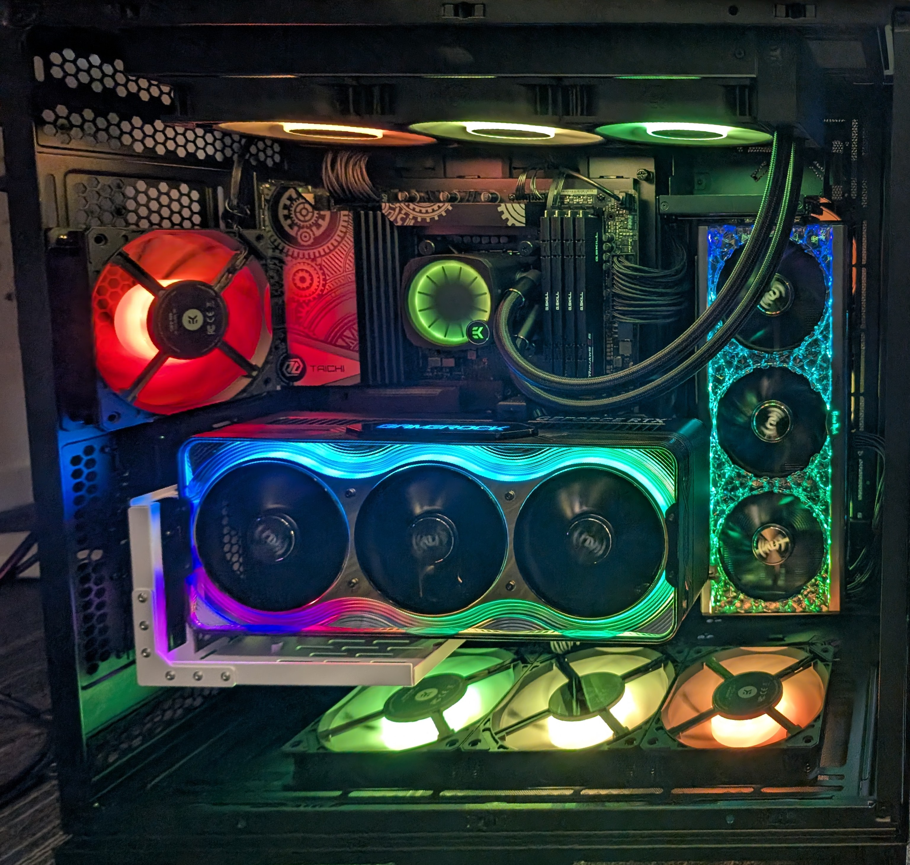
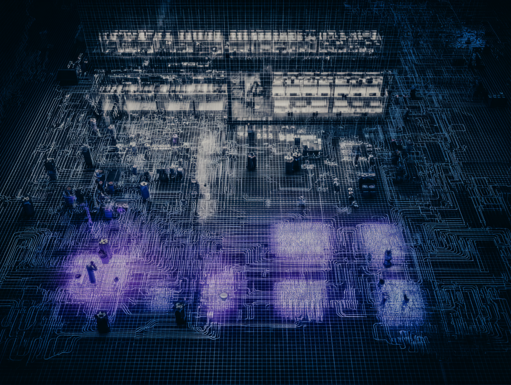

<!-- _class: lead -->
<!-- Time: 0:00-0:30 -->

# Building Enterprise Multi-Agent AI Systems Locally

## Demonstrating the Power of Local AI Models in Agentic Pipelines

**Magnús Smári Smárason**  
*Oxford AI Summit 2025*

---
<!-- Time: 0:30-1:30 -->

# My Journey with Local AI

**Started with Ollama from the beginning** - fascinated by local models

• Experimented with LLMs, Stable Diffusion, Flux  
• Strong believer in **learning by experimenting**  
• Built production systems for University of Akureyri  
• Used Yin & Ollama at **30,000 feet** working on these slides!

*"Local AI models have their place in the AI economy"*

---
<!-- Time: 1:30-2:30 -->

# Key Insights from the Journey

**Local AI is part of a broader ecosystem - not a replacement**

• Understand **multi-agent patterns** for collaboration  
• Achieve **technical feasibility** with modern quantization  
• Enable **flexible deployment** - isolated, hybrid, or integrated  
• Create **domain-specific excellence** through specialization

*Let me show you what we've built...*

---
<!-- Time: 2:30-4:00 -->

# My AI Projects in Production

<div class="columns">
<div>


**BORG Ecosystem**
Full-stack AI platform for University

</div>
<div>


**Arctic Species Tracker**
Environmental monitoring with AI

</div>
</div>

<div style="text-align: center; margin-top: 20px;">


**Fire Protection Iceland** - Data-driven safety analysis

</div>

---
<!-- Time: 4:00-5:00 -->

# The BORG Story

**"Borg" means city in Icelandic** 🇮🇸

• University campus: **SólBorg** = "Sun City" (ironic for Iceland!)  
• Star Trek easter egg: modular **"Borg cubes"** architecture  
• Built by 2 developers + IT support since January  
• Serves entire university with hybrid local/cloud AI

*"Trekkers don't snitch..."* 🖖

**Key**: Proving local AI works at institutional scale

---
<!-- Time: 5:00-6:00 -->

# The Hardware Behind Local AI

<div class="columns">
<div>

## University AI Lab Setup
- **GPUs**: RTX 5090 + 4090
- **Purpose**: Experimentation & Production
- **Access**: Local VM infrastructure
- **Result**: Complete AI sovereignty

*"This is where the magic happens - no cloud required"*

</div>
<div>



</div>
</div>

---
<!-- Time: 6:00-7:00 -->

# Beyond Chat: Real AI Applications

**Multimodal Production Pipeline**

1. **Fine-tuned Whisper** → Podcast transcription (local)
2. **Gemini 2.5 Pro** → Episode summary & blog post
3. **Image generation** → Visual prompts from mood
4. **Music generation** → Suno prompts for soundtrack

**Key Point**: Local models enable creative workflows anywhere
- Even at 30,000 feet without internet!

---
<!-- Time: 7:00-8:00 -->

# Not Always an Aircraft Carrier

## Sometimes a Speedboat is Perfect

**Smaller models have their place:**
• Clear, focused tasks with specific requirements  
• Privacy-sensitive environments  
• Offline or restricted network scenarios  
• Rapid prototyping and experimentation  

*"You don't need GPT-4 to sort a list"*

---
<!-- Time: 8:00-9:00 -->

# Privacy & Professional Peace of Mind

**It's not that cloud is unsafe - it's about user experience**

• **Doctors & Lawyers**: Regulatory compliance made simple  
• **Researchers**: Complete data sovereignty  
• **Developers**: Unrestricted experimentation  

*"There's a unique calm in an unplugged AI sandbox"*

**The feeling of total control over your AI infrastructure**

---
<!-- Time: 9:00-10:00 -->

# The Problem We're Solving

**Single AI models hit real limitations:**

- **Limited Perspective**: One model = one viewpoint
- **No Specialization**: General models lack domain expertise
- **Flexibility Constraints**: Cloud APIs limit customization
- **Data Control**: Sensitive data requires local processing
- **No Learning**: Each query starts from scratch

**My Pain Point**: Building complex research systems that actually work

---
<!-- Time: 10:00-11:30 -->

# Platform: LocalMind Collective

**Multi-Agent Research System - Live Demo Platform**

<div class="columns">
<div>

### Today's Agent Lineup
- **Principal Synthesizer** (deepseek-r1:8b)
- **Domain Specialist** (qwen3:8b)
- **Web Harvester** (qwen3:4b)
- **Fact Validator** (phi4-mini)
- **Quality Auditor** (phi4-mini)

</div>
<div>

### Why These Models?
- **Optimized for speed** in live demos
- **Total VRAM**: ~18GB
- **Consumer hardware** compatible
- **Real reasoning** capabilities
- **Production tested**

</div>
</div>

---
<!-- Time: 11:30-13:00 -->

# Live Agent Specifications

| Agent | Model | Purpose | VRAM | Speed |
|-------|-------|---------|------|-------|
| **Principal Synthesizer** | deepseek-r1:8b | Deep reasoning & orchestration | 5.2GB | 3 min |
| **Domain Specialist** | qwen3:8b | Expert domain analysis | 5.2GB | 2 min |
| **Web Harvester** | qwen3:4b | Quick web research | 2.6GB | 90 sec |
| **Fact Validator** | phi4-mini | Claim verification | 2.5GB | 1 min |
| **Quality Auditor** | phi4-mini | Output assessment | 2.5GB | 1 min |

**Key**: All models run on consumer GPUs (RTX 3080/4070+)

---
<!-- Time: 13:00-14:30 -->

# How This Is Truly Agentic

| Agent Feature | Our Implementation |
|--------------|-------------------|
| **Autonomy** | Agents self-select based on query complexity |
| **Reactivity** | Real-time adaptation to research findings |
| **Proactivity** | Agents suggest follow-up investigations |
| **Social Ability** | Inter-agent negotiation for conflict resolution |
| **Learning** | Persistent memory across sessions (SQLite) |

**Not just parallel execution - true multi-agent collaboration**

---
<!-- Time: 14:30-15:30 -->

# Agent Collaboration Visualization



*Real-time agent communication and coordination*

---
<!-- Time: 15:30-17:00 -->

# Technical Architecture

<div class="columns">
<div>

## Model Selection
**Dynamic based on VRAM**
```python
model = select_optimal_model(
  available_vram, 
  task_requirements
)
```

**Quantization enables large models on consumer hardware**

</div>
<div>

## Orchestration Flow
1. **Query Analysis** → Complexity assessment
2. **Agent Selection** → Based on domain
3. **Parallel Execution** → Streaming progress
4. **Synthesis** → Conflict resolution
5. **Quality Check** → Final validation

</div>
</div>

---
<!-- Time: 17:00-18:00 -->

# Flexible Deployment Options


**Three deployment modes:**
1. **Isolated**: Fully local, no external dependencies
2. **Hybrid**: Local + Brave API for web search
3. **Integrated**: Part of larger systems (like BORG)

---
<!-- Time: 18:00-19:00 -->

# Demo Scenarios

### 🔹 Simple Query (30 seconds)
```bash
"What is quantum computing?"
```

### 🔹 Complex Analysis (2 minutes)
```bash
"Analyze mRNA vaccine mechanisms, efficacy data, 
 and therapeutic applications"
```

### 🔹 Current Events (1 minute)
```bash
"Latest AI safety developments"
```

---
<!-- Time: 19:00-25:00 -->

# Live Demo

<!-- Full screen for actual demo -->

<div style="text-align: center; font-size: 48px; margin-top: 200px;">

**🚀 Live Multi-Agent Demo**

*Watch the agents collaborate in real-time*

</div>

---
<!-- Time: 25:00-26:00 -->

# What You Just Witnessed

**Real models running locally:**
• No cloud dependencies  
• Agent collaboration in action  
• Streaming responses  
• VRAM management  
• Quality assessment  

**This is production-ready technology today**

---
<!-- Time: 26:00-27:00 -->

# Production Insights

<div class="columns">
<div>

## Technical Lessons
- **Model Selection**: Balance size/speed
- **Quantization**: Q4_K_M sweet spot
- **VRAM Management**: Dynamic allocation
- **Context Windows**: 16-32K sufficient

</div>
<div>

## Real Impact
- **BORG**: Serving university users
- **Cost Savings**: No API fees
- **Data Sovereignty**: Complete control
- **Innovation**: Unrestricted experimentation

</div>
</div>

---
<!-- Time: 27:00-28:00 -->

# Key Takeaways

1. **Local AI enables new possibilities** beyond cost savings
2. **Multi-agent patterns work** in production today
3. **Consumer hardware is sufficient** for enterprise AI
4. **Hybrid approaches** offer best of both worlds
5. **You can build this** with available tools

*"This is one approach - the patterns apply broadly"*

---
<!-- Time: 28:00-29:30 -->

# Your Imagination is the Limit

**From my youth science workshop this week:**

> "If you understand AI capabilities and limitations,  
> your biggest restriction is your imagination.  
> **Now go build something!**"

*The same message I share with you today*

🚀 **Start experimenting. Start building. Start local.**

---
<!-- Time: 29:30-30:00 -->
<!-- _class: lead -->

# Q&A

<div style="text-align: center;">


*Scan for GitHub Repository*

**GitHub**: github.com/Magnussmari/multi-agent-research-system  
**Email**: magnus@smarason.is  
**Web**: www.smarason.is

</div>

### How can local AI fit into your architecture?

---